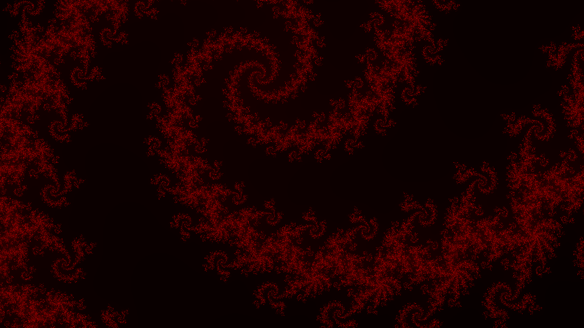

# fractalogy
Parallel computation systems project

Command for a 4K wallpaper generated in the root of the project

    bin/fractalogy -s 3840x2160 -t 8192 -o wallpaper.png -r -0.062512735315726:-0.062512735064873:-1.0368372781588:-1.0368372780177 -q

with the following color setup:

    pixel->red = rgb_value(iter - 370, 1000);
    pixel->green = rgb_value(0, 1000);
    pixel->blue = rgb_value(0, 1000);

We get an image looking like that:

